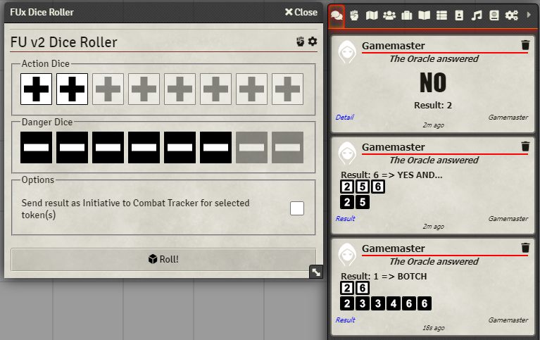
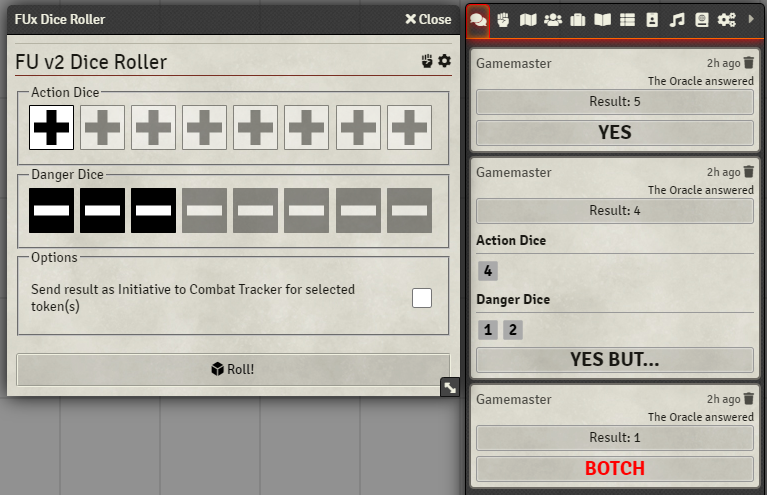

[](https://ko-fi.com/ramses800) 
# FUx Dice Roller

Dice roller for FreeForm Universal(FU) RPG Classic & v2(beta), Action Tales! RPG(Dungeon Crawlers, Neon City Overdrive RPG, Hard City RPG, Star Scoundrels RPG, Tomorrow City), Earthdawn - Age Of Legend

Built-in support for 

- Game system Sandbox chat result style
- Dice So Nice

The dice roller is not dependent on any specific Foundry game system but can used in any game system.
### Recommended Foundry Game systems
- [Sandbox System Builder](https://foundryvtt.com/packages/sandbox)
- [Simple World-Building](https://foundryvtt.com/packages/worldbuilding)


## Installation
### Directly inside Foundry
FUx Dice Roller can be installed from Foundry´s configuration meny under "Add-on Module", and choose "Install module", filter package for "FUx Dice Roller"
### Manifest URL
https://raw.githubusercontent.com/Anderware/Foundry-Vtt-Sandbox-Macros/main/Modules/FUx-Dice-Roller/releases/module.json

See here on help on how to use the manifest URL to install a module  
[Foundry Wiki - How to install module](https://foundryvtt.wiki/en/basics/Modules) 

## Variants

### FU v2

As taken from FU v2 beta

#### For game system Sandbox



#### Other Foundry game systems than Sandbox



### Neon City Overdrive/Action! Tales


### FU Classic

In Classic, the roller will reduce selected Action(Start + Bonus)/Danger(Penalty)dice before the roll

The oracle used for Classic is the alternative numbering(1-3 Bad, 4-6 Good result) and not the default Even/Odd due to programming reasons.


## Launching FUx Dice Roller

The dice roller can be launched by clicking the FU icon on the Chat tab of the sidebar


The dice roller can  also be launched from the Module Settings window


## Roll commands from chat

FUx Dice roller support chat commands to roll

Command format

```
/fux xayd
```

where x is the number of Action Dice and y is the number of Danger Dice

*Example.*

*This will roll 2 Action Dice and 1 Danger Dice*

```
/fux 2a1d
```


## Settings


## FU v2 Combat Helper

If the current system variant is FU v2, a Combat Helper is available on the dice roller

The Combat Helper makes it easy to quickly determine attacks and defend effects.

